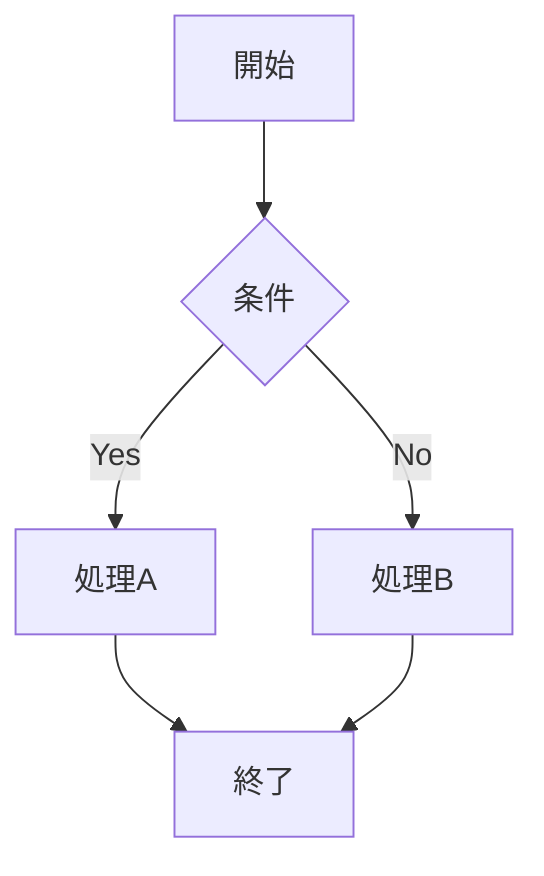

# GitHub Flavored Markdown 記法集

## Alerts（強調ブロック）

気軽に使ってよい。内容を目立たせたいときに積極的に活用する。

```markdown
> [!NOTE]
> 流し読みするユーザーにも伝えたい補足情報。

> [!TIP]
> より良いやり方・便利な使い方のヒント。

> [!IMPORTANT]
> ゴール達成に必要な重要情報。

> [!WARNING]
> 問題を避けるために即座に注意が必要な情報。

> [!CAUTION]
> 特定の操作によるリスクや悪影響の警告。
```

## Collapsed section（折り畳みセクション）

長いコードブロック・インストール手順・詳細説明を折り畳む。READMEをすっきり見せたいときに使う。

```markdown
<details>

<summary>詳細を表示</summary>

### 見出しも使える

テキスト、コードブロック、画像も入れられる。

```bash
echo "Hello World"
```

</details>
```

> [!NOTE]
> `<details>` と `<summary>` の後には空行が必要。

## Mermaid diagram（図）

コードブロックの言語に `mermaid` を指定するとGitHubが図として描画する。アーキテクチャ図やフローチャートに便利。

````markdown

````

他にも `sequenceDiagram`、`classDiagram`、`gitGraph`、`erDiagram` などが使える。

## Footnotes（脚注）

本文を汚さずに補足・参考リンクを追加したいときに使う。

```markdown
GitHubのMarkdownは GFM[^1] をベースにしている。

[^1]: [GitHub Flavored Markdown Spec](https://github.github.com/gfm/)
```

## Strikethrough（取り消し線）

`~~text~~` → ~~text~~

変更履歴や「廃止になった機能」の説明に使う。

## Keyboard shortcut（キーボードキー表示）

`<kbd>Ctrl</kbd> + <kbd>C</kbd>` → <kbd>Ctrl</kbd> + <kbd>C</kbd>

ショートカットキーやキーボード操作の説明に使う。

## Emoji shortcode（絵文字）

`:emoji_name:` で絵文字を埋め込める。READMEのトップや見出しを視覚的に分かりやすくするのに便利。

```markdown
## 🚀 Getting Started   <!-- Unicode絵文字でもOK -->
## :rocket: Getting Started  <!-- shortcodeでもOK -->
```

よく使うもの: `:warning:` ⚠️  `:information_source:` ℹ️  `:white_check_mark:` ✅  `:x:` ❌  `:bulb:` 💡  `:memo:` 📝  `:rocket:` 🚀  `:construction:` 🚧

## Badges（バッジ）

README冒頭でステータスや情報を視覚的に示すのに使う。[shields.io](https://shields.io/) でバッジを生成する。

```markdown
<!-- 静的バッジ: https://shields.io/badges/static-badge -->


<!-- GitHub連携バッジ: https://shields.io/badges/git-hub-actions-workflow-status -->


```

---

## 使いどころのガイド

| 記法 | 使うシーン |
| :--- | :--- |
| Alerts | 重要な注意事項・ヒント・警告 |
| Collapsed section | 長い手順・詳細設定・変更ログの旧バージョン |
| Mermaid | アーキテクチャ・フロー・シーケンス図 |
| Badges | リポジトリのステータス表示（CI・ライセンス・バージョン） |
| `<kbd>` | キーボードショートカットの説明 |
| Footnotes | 参考文献・注釈を本文から分離したいとき |
