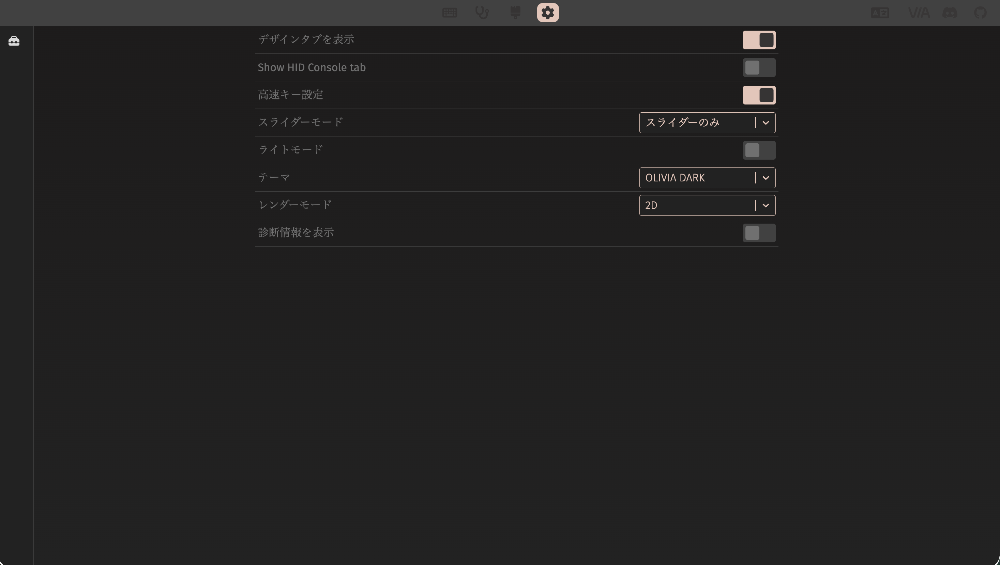
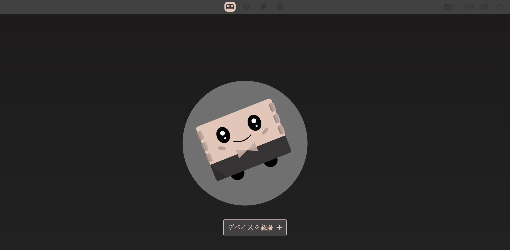
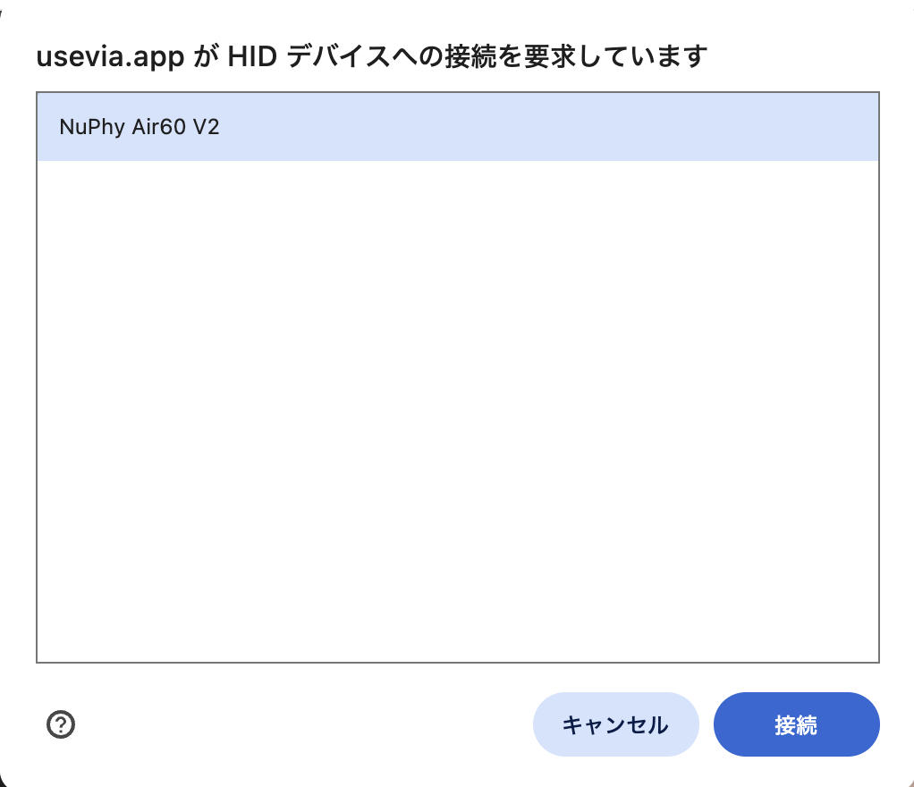
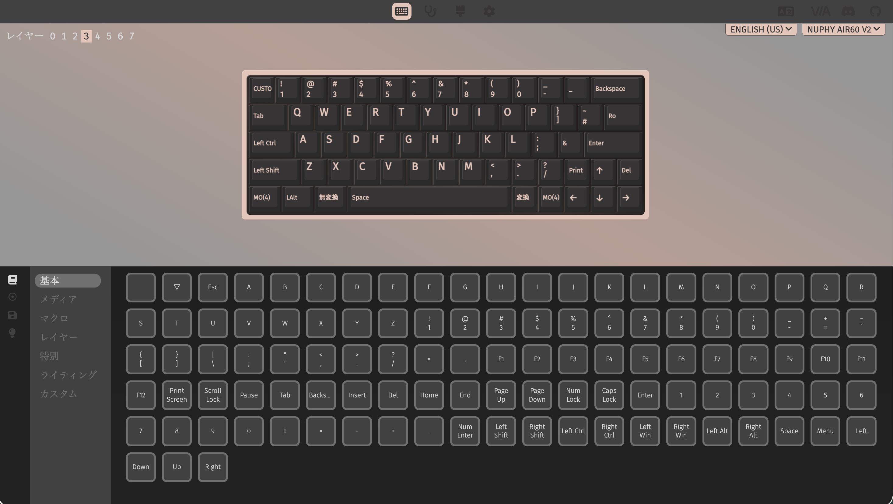

# NuPhy Air60 V2 QMK設定

## Overview

WindowsのJIS配列設定を変更せず、NuPhy Air60 V2側でUS ANSI物理配列に合う入力へ補正する。

- QMK CLI 経由で設定のビルドと書き込みを行う
- [nuphy-src/qmk_firmware](https://github.com/nuphy-src/qmk_firmware/tree/nuphy-keyboards/keyboards/nuphy/air60_v2/ansi) を git submodule でimportし、keymapのみカスタムしたものをソースコードとして利用
- QMK と VIA を併用してキーマップの最終設定を調整

## Prerequisites

- NuPhy Air60 V2
- USB Type-Cケーブル
- `curl`（`qmk` ダウンロード用）
- Google Chrome（VIA Web App利用時）

## Setup

### submoduleの初期化

dotfilesリポジトリのルートで実行する。

```bash
git submodule update --init --recursive
```

### QMK CLIの導入

QMK公式インストーラを使用する。この処理はdotfiles全体のセットアップには含めない。

```bash
curl -fsSL https://install.qmk.fm | sh
qmk --version
qmk doctor
```

以下のコマンドで何も出力されず、"Please run ~~~" のようなメッセージが出た場合はそれに従う（Pythonパッケージのインストール）
```
qmk list-keyboards | grep -i air60
```

### keymapの配置

管理対象の設定をsubmodule内のビルド位置へコピーする。

```bash
mkdir -p \
  keyboards/nuphy-air60-v2/qmk_firmware_nuphy/keyboards/nuphy/air60_v2/ansi/keymaps/jis_us

cp keyboards/nuphy-air60-v2/keymap.gitignore \
  keyboards/nuphy-air60-v2/qmk_firmware_nuphy/keyboards/nuphy/air60_v2/ansi/keymaps/jis_us/.gitignore

cp keyboards/nuphy-air60-v2/keymap.c \
  keyboards/nuphy-air60-v2/qmk_firmware_nuphy/keyboards/nuphy/air60_v2/ansi/keymaps/jis_us/keymap.c

cp keyboards/nuphy-air60-v2/rules.mk \
  keyboards/nuphy-air60-v2/qmk_firmware_nuphy/keyboards/nuphy/air60_v2/ansi/keymaps/jis_us/rules.mk
```

`keymap.gitignore` はコピー先のディレクトリ全体をGitの無視対象にする。submodule内のビルド用ファイルは通常の `git add` では登録されないため、設定変更はこのディレクトリ直下の `keymap.c` と `rules.mk` に反映する。

## Usage

### ビルド

```bash
cd keyboards/nuphy-air60-v2/qmk_firmware_nuphy
qmk compile -kb nuphy/air60_v2/ansi -km jis_us
```

成功すると、submoduleのルートに `nuphy_air60_v2_ansi_jis_us.bin` が生成される。

### Flash

> [!IMPORTANT]
> 必ずファームウェアをFlashした後にVIA設定をImportする。Flashすると保存済みのVIA設定が消えるため、逆の順番では設定作業が無駄になる。

キーボード本体を次の状態にして、有線接続する。

| 物理スイッチ | 設定 |
| :--- | :--- |
| `WIN` / `MAC` | `WIN` |
| `OFF` / `WIRED` / `WIRELESS` | `WIRED` |

```bash
cd keyboards/nuphy-air60-v2/qmk_firmware_nuphy
qmk flash -kb nuphy/air60_v2/ansi -km jis_us
```

> [!TIP]
> Flashが途中で停止する場合、一度USB-Cケーブルを抜き、<kbd>Esc</kbd>を押したまま再接続すると書き込みに成功することがある。

### VIA設定の復元

| 手順 | キャプチャ | 補足 |
| :--- | :--- | :--- |
| キーボードをMacbookに接続する | | |
| Google Chromeで[VIA Web App](https://usevia.app/)を開く。画面上部の歯車アイコンを押し、「デザインタブを表示」をオンにする |  | 「デザイン」画面を表示するために必要 |
| 画面上部のペイントブラシアイコンを押す。「ローカルレイアウトを読み込む」の「読み込み」から `via-definition.json` を選択する |  | |
| 画面上部のキーボードアイコンを押し、「デバイスを認証」を押す |  | 「デバイスを認証」を押しても画面が変わらない場合は、VIA Web Appを一度リロードしてから再度認証する。 |
| ChromeのHID接続ダイアログで「NuPhy Air60 V2」を選択し、「接続」を押す |  | |
| 画面左側のフロッピーディスクアイコンを押し、保存したレイアウトを読み込む操作から `via-layout.json` を選択する |  | 設定を変更した場合は、Exportした内容で `via-layout.json` を上書きする |

## Directory Structure

```bash
.
├── captures/                  # VIA設定手順のスクリーンショット
│   ├── via-design.png
│   ├── via-device-authentication.png
│   ├── via-hid-connection.png
│   ├── via-layout.png
│   └── via-settings.png
├── qmk_firmware_nuphy/        # 特定commitに固定したNuPhy QMK forkのsubmodule
├── README.md                  # セットアップ、ビルド、Flash、VIA復元の手順
├── keymap.gitignore           # submodule内のビルド用keymapをGitの追跡対象外にする設定
├── keymap.c                   # keymapとJISホスト向けKey Override
├── rules.mk                   # VIAとKey Overrideの有効化
├── via-definition.json        # VIAの「デザイン」画面へ読み込むキーボード定義。入手元: https://nuphy.com/pages/json-files-for-nuphy-keyboards
└── via-layout.json            # VIAで管理する最新のDynamic Keymap設定
```

## Note

- WindowsではLayer 3を通常レイヤー、Layer 4をFnレイヤー、Layer 5をFn + Shiftレイヤーとして使う。左上キーはLayer 3で独自キーコード `US_GRV`、Layer 4で `KC_ESC`、Layer 5で `JP_TILD` に固定している。
- VIAの設定はEEPROM上のDynamic Keymapとして保存されるため、`keymap.c` の初期値を上書きすることがある。上記の左上キー3箇所はVIAで変更しない。
- `US_GRV` はNuPhy側の既存カスタムキーコード `BAT_NUM` の次から割り当てている。NuPhy forkの更新時は、この前提が変わっていないことを確認する。
