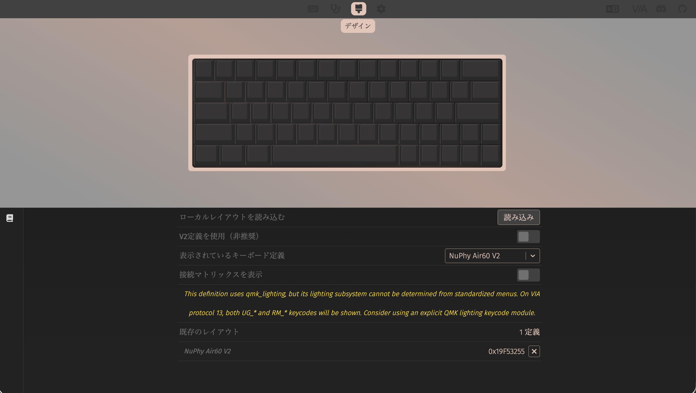

# NuPhy Air60 V2 QMK設定

## Overview

会社支給WindowsのJIS配列設定を変更せず、NuPhy Air60 V2側でUS ANSI物理配列に合う入力へ補正する。NuPhyのQMK forkと個人設定を分離し、このディレクトリだけでファームウェアのビルド・書き込みとVIA設定の復元を行う。

主な設定は次のとおり。

- JISホスト上で `Shift + 2` → `@` などUS配列相当の記号を入力
- macOSの <kbd>Control</kbd> + <kbd>A</kbd> / <kbd>E</kbd> による行頭・行末移動を、Windowsでは <kbd>Alt</kbd> + <kbd>A</kbd> / <kbd>E</kbd> で再現
- 左上キーで <code>&#96;</code>、<kbd>Shift</kbd>との同時押しで `~`
- <kbd>Fn</kbd> + 左上キーで <kbd>Esc</kbd>
- Fnレイヤーにファンクションキー、音量、メディア、RGB、サイドライト操作を配置

## Prerequisites

- macOS
- `git`
- `curl`
- NuPhy Air60 V2 ANSI
- Google Chrome（VIA Web App利用時）

## Setup

### submoduleの初期化

dotfilesリポジトリのルートで実行する。

```bash
git submodule update --init --recursive
```

### QMK CLIの導入

QMK公式インストーラを使用する。この処理はdotfiles全体のセットアップには含めない。

```bash
curl -fsSL https://install.qmk.fm | sh
qmk --version
qmk doctor
```

QMK CLIがNuPhy forkのPython依存不足を表示した場合は、エラーに示されたPython環境へ依存を追加する。Pythonのパスはインストール方法により異なる。

```bash
<エラーに表示されたPythonのパス> -m pip install -r \
  keyboards/nuphy-air60-v2/qmk_firmware_nuphy/requirements.txt
```

### keymapの配置

管理対象の設定をsubmodule内のビルド位置へコピーする。

```bash
mkdir -p \
  keyboards/nuphy-air60-v2/qmk_firmware_nuphy/keyboards/nuphy/air60_v2/ansi/keymaps/jis_us

cp keyboards/nuphy-air60-v2/keymap.gitignore \
  keyboards/nuphy-air60-v2/qmk_firmware_nuphy/keyboards/nuphy/air60_v2/ansi/keymaps/jis_us/.gitignore

cp keyboards/nuphy-air60-v2/keymap.c \
  keyboards/nuphy-air60-v2/qmk_firmware_nuphy/keyboards/nuphy/air60_v2/ansi/keymaps/jis_us/keymap.c

cp keyboards/nuphy-air60-v2/rules.mk \
  keyboards/nuphy-air60-v2/qmk_firmware_nuphy/keyboards/nuphy/air60_v2/ansi/keymaps/jis_us/rules.mk
```

`keymap.gitignore` はコピー先のディレクトリ全体をGitの無視対象にする。submodule内のビルド用ファイルは通常の `git add` では登録されないため、設定変更はこのディレクトリ直下の `keymap.c` と `rules.mk` に反映する。

## Usage

### ビルド

```bash
cd keyboards/nuphy-air60-v2/qmk_firmware_nuphy
qmk compile -kb nuphy/air60_v2/ansi -km jis_us
```

成功すると、submoduleのルートに `nuphy_air60_v2_ansi_jis_us.bin` が生成される。

### Flash

キーボード本体を次の状態にして、有線接続する。

| 物理スイッチ | 設定 |
| :--- | :--- |
| `WIN` / `MAC` | `WIN` |
| `OFF` / `WIRED` / `WIRELESS` | `WIRED` |

> [!IMPORTANT]
> 必ずファームウェアをFlashしてからVIA設定をImportする。Flashすると保存済みのVIA設定が消えるため、逆の順番では設定作業が無駄になる。

```bash
cd keyboards/nuphy-air60-v2/qmk_firmware_nuphy
qmk flash -kb nuphy/air60_v2/ansi -km jis_us
```

> [!TIP]
> Flashが始まらない、または `Bootloader not found` と表示された場合は、一度USB-Cケーブルを抜き、<kbd>Esc</kbd>を押したまま再接続すると書き込みに成功したことがある。DFUデバイスが認識されると書き込みが始まる。

### VIA設定の復元

1. Google Chromeで[VIA Web App](https://usevia.app/)を開く。
1. 画面上部の歯車アイコンを押して設定画面を開き、「デザインタブを表示」をオンにする。

   

1. 画面上部のペイントブラシアイコンを押して「デザイン」画面を開く。
1. 「ローカルレイアウトを読み込む」の「読み込み」を押し、`via-definition.json` を選択する。

   

1. 画面上部のキーボードアイコンを押してキーマップ設定画面を開き、「デバイスを認証」を押す。

   

1. ChromeのHID接続ダイアログで「NuPhy Air60 V2」を選択し、「接続」を押す。

   

1. 画面左側のフロッピーディスクアイコンを押し、保存したレイアウトを読み込む操作から `via-layout.json` を選択する。

   

> [!TIP]
> 「デバイスを認証」を押しても画面が変わらない場合は、VIA Web Appを一度リロードしてから再度認証する。

| ファイル | 用途 |
| :--- | :--- |
| `via-definition.json` | Design画面でNuPhy Air60 V2を認識させるためのローカル定義 |
| `via-layout.json` | Configure画面からExportした最新のDynamic Keymap設定 |

`via-definition.json` の入手元: [JSON Files for NuPhy Keyboards](https://nuphy.com/pages/json-files-for-nuphy-keyboards)

VIAで設定を変更した場合は、ExportしたJSONで `via-layout.json` を更新する。

## Directory Structure

```text
.
├── assets/                    # VIA設定手順のスクリーンショット
│   ├── via-design.png
│   ├── via-device-authentication.png
│   ├── via-hid-connection.png
│   ├── via-layout.png
│   └── via-settings.png
├── qmk_firmware_nuphy/        # 特定commitに固定したNuPhy QMK forkのsubmodule
├── README.md                  # セットアップ、ビルド、Flash、VIA復元の手順
├── keymap.gitignore           # submodule内のビルド用keymapをGitの追跡対象外にする設定
├── keymap.c                   # keymapとJISホスト向けKey Override
├── rules.mk                   # VIAとKey Overrideの有効化
├── via-definition.json        # VIAの「デザイン」画面へ読み込むキーボード定義
└── via-layout.json            # VIAで管理する最新のDynamic Keymap設定
```

## Note

WindowsではLayer 3を通常レイヤー、Layer 4をFnレイヤー、Layer 5をFn + Shiftレイヤーとして使う。左上キーはLayer 3で独自キーコード `US_GRV`、Layer 4で `KC_ESC`、Layer 5で `JP_TILD` に固定している。

VIAの設定はEEPROM上のDynamic Keymapとして保存されるため、`keymap.c` の初期値を上書きすることがある。上記の左上キー3箇所はVIAで変更しない。

`US_GRV` はNuPhy側の既存カスタムキーコード `BAT_NUM` の次から割り当てている。NuPhy forkの更新時は、この前提が変わっていないことを確認する。
