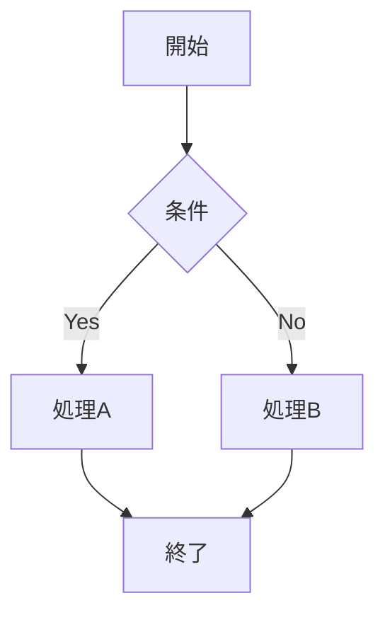
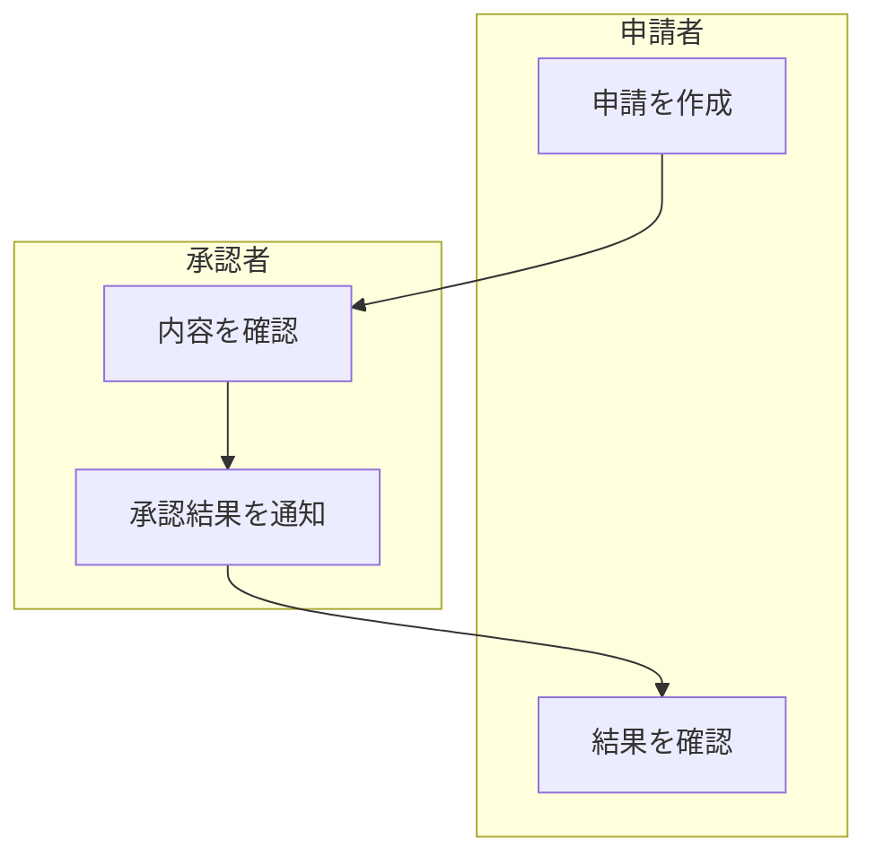

# Mermaid diagram（図）

コードブロックの言語に `mermaid` を指定するとGitHubが図として描画する。アーキテクチャ図やフローチャートに便利。

````markdown

````

他にも `sequenceDiagram`、`classDiagram`、`gitGraph`、`erDiagram` などが使える。

## T→Bのスイムレーンチャート

担当者・システムごとの処理を `subgraph` でまとめ、処理の流れを上から下へ示す。以下は申請者と承認者のレーンを分けた例。

````markdown

````

`TB` は上から下への方向指定（`TD` も同義）。レーンをまたぐ接続があると、subgraph内の方向指定は親グラフの方向に従うため、この例では全体を `TB` にする。レーンの配置や幅は自動レイアウトに依存する。

構文の詳細は [Mermaid公式のFlowcharts](https://mermaid.js.org/syntax/flowchart.html) を参照。
