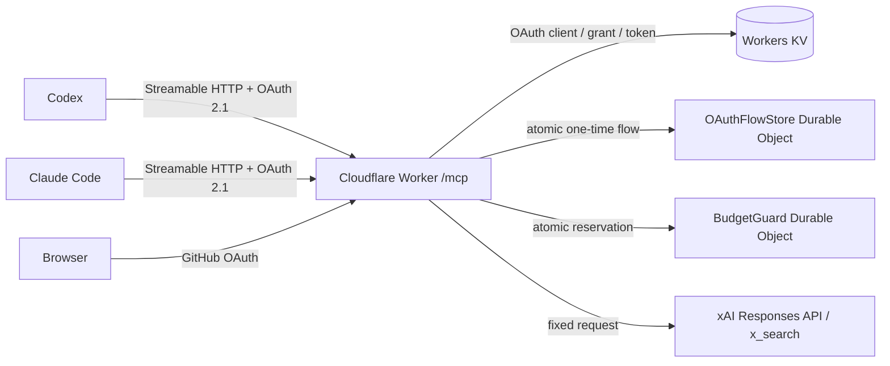

# xAI X Search Remote MCP

## Overview

Cloudflare Workers上で動作する、個人用のX検索専用Remote MCP。CodexとClaude Codeから同じStreamable HTTPエンドポイントへ接続し、ユーザーがX検索を明示した場合だけxAI Responses APIの`x_search`を呼び出す。

- GitHub OAuthで取得した変更されない数値user IDがallowlistと一致した場合だけMCPトークンを発行する
- API keyとClient SecretはCloudflare Worker Secretに保存する
- xAI側のモデル、reasoning、X検索回数、出力量をサーバー側で固定する
- Durable Objectで分間・日次の検索回数を原子的に制限する
- APMにはMCPの公開URLだけを登録し、OAuth discoveryとCIMD/DCRは各クライアントへ任せる

## Prerequisites

### ツール

| ツール | 用途 |
| :--- | :--- |
| Node.js / npm | 依存関係、テスト、デプロイ |
| Wrangler | CloudflareリソースとWorkerの管理 |
| GitHub CLI | GitHubの数値user ID確認 |
| CodexまたはClaude Code | MCPクライアント |

### アカウントと権限

| 対象 | 必要なもの |
| :--- | :--- |
| Cloudflare | Workers、KV、Durable Objectsを作成・デプロイできるアカウント権限 |
| GitHub | OAuth Appを作成できるアカウント |
| xAI | API keyを発行でき、X Searchを利用できるTeam |

### Secret

| 名前 | 発行元 | 保存先 |
| :--- | :--- | :--- |
| `XAI_API_KEY` | xAI Console | Cloudflare Worker Secret |
| `GITHUB_CLIENT_SECRET` | GitHub OAuth App | Cloudflare Worker Secret |

Secretの実値は`wrangler.jsonc`、README、APM設定へ書かない。ローカル開発で使う`.dev.vars*`と`.env*`もgitignore対象とする。`wrangler.jsonc`の`secrets.required`はSecret名だけを宣言し、値は含まない。

### 公開設定

以下は認証情報ではなく、デプロイの再現に必要な公開識別子として`wrangler.jsonc`で管理する。

| 名前 | 公開できる理由 |
| :--- | :--- |
| `PUBLIC_ORIGIN` | インターネットからアクセスするWorker URL |
| `GITHUB_CLIENT_ID` | OAuth認可URLにも含まれるアプリ識別子。Client Secretとは異なる |
| `ALLOWED_GITHUB_USER_ID` | GitHub公開プロフィールから取得できる数値user ID |
| KV namespace ID | バインディング対象の識別子。単独ではCloudflare APIへアクセスできない |

## Setup

### 1. 依存関係とCloudflare認証

```bash
cd tools/xai-search-mcp
npm ci --ignore-scripts
npx wrangler login
```

### 2. GitHub OAuth App

[GitHub OAuth App](https://github.com/settings/developers)を、このMCP専用として作成する。他サービスと共有すると、以前に付与した広いscopeがGitHub tokenへ引き継がれ得るため共有しない。

| GitHub設定 | 値 |
| :--- | :--- |
| Homepage URL | `https://xai-search-mcp.<workers-subdomain>.workers.dev` |
| Authorization callback URL | `<Homepage URL>/callback` |

Client IDを`wrangler.jsonc`へ設定し、Client Secretは後の手順でWorker Secretへ登録する。GitHub user IDは以下で確認する。

```bash
gh api user --jq .id
```

### 3. xAIの課金設定

xAI ConsoleでAPI keyを発行する。auto top-upを無効にし、invoiced billing limitを`$0`にして、プリペイド残高を超える課金をxAI側でも止める。[xAI Billing](https://docs.x.ai/console/billing)

### 4. OAuth Provider用KV namespace

```bash
npx wrangler kv namespace create OAUTH_KV
```

出力されたnamespace IDを`wrangler.jsonc`へ設定する。KVはOAuth Providerライブラリのclient、grant、token保存に使う。一時的なconsent flowとGitHub stateには、強整合な`OAuthFlowStore` Durable Objectを使う。[Workers KV consistency](https://developers.cloudflare.com/kv/concepts/how-kv-works/)、[Durable Objects storage](https://developers.cloudflare.com/durable-objects/best-practices/access-durable-objects-storage/)

### 5. 公開設定

`wrangler.jsonc`の以下を環境に合わせる。

| 項目 | 設定値 |
| :--- | :--- |
| `PUBLIC_ORIGIN` | WorkerのHTTPS origin。末尾`/`なし |
| `GITHUB_CLIENT_ID` | GitHub OAuth AppのClient ID |
| `ALLOWED_GITHUB_USER_ID` | `gh api user --jq .id`の数値 |
| `kv_namespaces[0].id` | 作成したKV namespace ID |

### 6. Secretとデプロイ

```bash
npx wrangler secret put XAI_API_KEY
npx wrangler secret put GITHUB_CLIENT_SECRET
npm run check
npm run deploy
```

> [!WARNING]
> `.dev.vars`はローカル開発専用でGit管理外。実値を`.dev.vars.example`、`wrangler.jsonc`、APM設定へ書かない。

## Usage

### APM

`../../apm/apm.yml`に本番URLを登録済み。mainへマージ後に適用する。

```bash
(cd ../.. && task skills)
```

APMにはURLだけを宣言する。Client IDやtokenは置かず、各クライアントが標準discoveryからCIMDまたはDCRを選択する。[APM MCP server guide](https://microsoft.github.io/apm/guides/mcp-servers/)

### Codex

APMを使わない場合の最小設定:

```toml
[mcp_servers.xai-search]
url = "https://xai-search-mcp.snhryt.workers.dev/mcp"
enabled_tools = ["x_search"]
default_tools_approval_mode = "prompt"
tool_timeout_sec = 90
```

```bash
codex mcp login xai-search
```

CodexはStreamable HTTP、OAuth、CIMD、DCRに対応する。[OpenAI公式MCPドキュメント](https://developers.openai.com/codex/mcp)

### Claude Code

APMを使わない場合はuser scopeへ追加する。

```bash
claude mcp add --transport http --scope user xai-search \
  https://xai-search-mcp.snhryt.workers.dev/mcp
claude mcp login xai-search
```

Claude CodeはHTTP MCPのOAuth discovery、CIMD、DCRに対応する。[Claude Code MCP documentation](https://code.claude.com/docs/en/mcp)

### 動作確認

```bash
MCP_ORIGIN=https://xai-search-mcp.snhryt.workers.dev
curl --fail --silent --show-error "$MCP_ORIGIN/health"
curl --silent --show-error "$MCP_ORIGIN/.well-known/oauth-protected-resource/mcp" | jq
curl --silent --show-error "$MCP_ORIGIN/.well-known/oauth-authorization-server" | jq
curl --include --silent --show-error --request POST "$MCP_ORIGIN/mcp" \
  --header 'Content-Type: application/json' \
  --data '{"jsonrpc":"2.0","id":1,"method":"initialize","params":{"protocolVersion":"2025-11-25","capabilities":{},"clientInfo":{"name":"smoke-test","version":"1"}}}'
```

最後の未認証リクエストが`401`と`WWW-Authenticate`を返し、保護リソースmetadata URLを示すことを確認する。必要なら[MCP Inspector](https://modelcontextprotocol.io/docs/tools/inspector)でもOAuthを含む接続を確認する。

### 同意POSTの診断

同意画面の送信に失敗した場合、レスポンス本文は秘密値を含まない`Consent state failure: <code>`を返す。GitHub callbackはこの区別を外部へ返さない。

| code | HTTP | 意味 |
| :--- | :--- | :--- |
| `missing` | 400 | flowが存在しない、消費済み、または期限切れ |
| `forbidden` | 400 | formから得たproofが保存済みhashと不一致 |
| `invalid` | 400 | flow ID・proof形式、またはDOへのconsume入力が不正 |
| `internal` | 503 | DO呼び出し失敗、想定外status、または不正な内部response |

## Architecture



Cloudflareの`createMcpHandler()`とMCP SDK v2を使う。セッションID、SSE互換サーバー、`McpAgent`は使わない。[Cloudflare MCP handler API](https://developers.cloudflare.com/agents/model-context-protocol/apis/handler-api/)

### セキュリティ境界

| 観点 | 実装 |
| :--- | :--- |
| 利用者 | GitHubの数値user IDを完全一致で検証。login名の変更に影響されない |
| MCP認可 | OAuth 2.1、S256 PKCE、RFC 9728/RFC 8414 discovery、CIMDとDCR。認可系エンドポイントを接続元IPごと5回/分に制限 |
| 同意画面 | 上流GitHubへ遷移する前に表示。強整合なDurable Objectへhash保存した使い捨てCSRF token、同一origin検証、補助cookie、10分TTL、CSPを適用 |
| OAuth一時state | consent approvalをGitHub stateへ原子的に遷移。GitHub stateとは独立したHttpOnly cookie秘密をproofにし、callbackで一度だけ消費 |
| GitHub権限 | S256 PKCE、追加scopeなし。数値ID確認後、GitHub tokenを保存せず失効 |
| xAI権限 | 接続先、モデル、reasoning、ツール、ツール回数、出力量をサーバー側で固定 |
| 課金防止 | 1ユーザーあたり5回/分、30回/UTC日。Durable Object transactionで呼び出し前に枠を予約 |
| 入出力 | query 2,000文字、handle 20件、期間366日。出力20,000文字、引用50件。画像・動画理解は無効 |
| ログ | 検索全文、Authorization、API key、上流エラー本文を出力しない。Workers Observabilityも無効 |

> [!IMPORTANT]
> 回数枠はxAI呼び出し前に消費し、上流エラー時も戻さない。障害時の利便性より、並行呼び出しや再試行による予算超過防止を優先する。ただし、回数上限は厳密なUSD上限ではないため、xAI側のspending limitまたはプリペイド残高も併用する。

xAIのX Searchは成功したツール呼び出し単位で課金され、1リクエスト内で複数回呼ばれ得る。このWorkerは`max_tool_calls: 1`を設定し、応答の実請求額も`cost_in_usd_ticks`から表示する。[xAI X Search](https://docs.x.ai/developers/tools/x-search)、[xAI Cost Tracking](https://docs.x.ai/developers/cost-tracking)、[xAI Pricing](https://docs.x.ai/developers/pricing)

xAIへ検索語と検索結果が送信され、既定ではAPIの入出力を監査目的で30日保持する。ZDRを確認できない状態では機密情報を検索語へ入れない。必要ならxAI TeamでZDRを有効化し、APIレスポンスの`x-zero-data-retention: true`を確認する。[xAI API Security FAQ](https://docs.x.ai/developers/faq/security)

## ADR

### Cloudflare WorkersでRemote MCPを運用する

- **背景**: CodexとClaude Codeから同じMCPを使い、第三者のMCPサーバーへxAI API keyを渡さずに運用する必要があった
- **決定**: Cloudflare Workers上でStreamable HTTP MCPを公開し、Secret、KV、Durable Objectsを同じCloudflareアカウント内で管理する
- **影響**: ローカルプロセスを常時起動せず複数クライアントから利用できる一方、Cloudflareのデプロイと状態ストアを管理する必要がある

### GitHub OAuthの数値user IDで利用者を制限する

- **背景**: Remote MCPは公開URLを持つため、URLを知る第三者によるxAI課金を防ぐ必要があった
- **決定**: 専用GitHub OAuth Appで本人確認し、変更可能なlogin名ではなく数値user IDをallowlistと照合する。GitHubへ追加scopeは要求しない
- **影響**: GitHubアカウントに依存するが、単一利用者を安定して識別できる。Client Secretと一時tokenはSecretとして扱う一方、Client IDと数値user IDは公開設定として管理する

### 一時OAuth stateと課金枠にDurable Objectsを使う

- **背景**: Workers KVは結果整合であり、同意flowの一度きり消費や並行検索時の厳密な回数予約には適さない
- **決定**: OAuth Provider自身のclient、grant、tokenはKVへ置き、一時flowと課金枠は責務別のDurable Objectへ分離する
- **影響**: 構成要素は増えるが、二重消費と並行呼び出しによる上限超過をtransactionで防止できる

### xAIリクエストの自由度をサーバー側で制限する

- **背景**: MCPクライアントからモデル、ツール回数、出力量を変更できると、意図しない機能利用と課金増加につながる
- **決定**: `grok-4.3`、reasoning `none`、X検索1回、出力1,200トークンに固定し、Web検索と画像・動画理解を許可しない。検索結果には一次情報と独立ソースを優先させる
- **影響**: 用途をX検索へ限定して費用を予測しやすくする代わりに、複雑な調査やメディア解析には対応しない

### APMではURLだけを配布する

- **背景**: CodexとClaude Codeの設定を宣言的に共有しつつ、資格情報をdotfilesへ含めない必要があった
- **決定**: `apm/apm.yml`にはRemote MCP URLだけを登録し、OAuthのClient IDとtokenは各クライアントの標準フローで取得・保存する
- **影響**: mainへマージ後は`task skills`で設定を配布できる。各クライアントでは初回だけブラウザ認証が必要になる

## Note

- 回数上限は`src/config.ts`の`PER_MINUTE_LIMIT`と`PER_DAY_LIMIT`を変更して再デプロイする
- xAI model、reasoning、ツール回数、出力量も同ファイルで固定する。クライアント入力からは変更できない
- Secretローテーションは`npx wrangler secret put <NAME>`で実施する
- 依存更新時は`npm install <package>@<version> --save-exact`を使い、`npm run check`と`npm audit`を通す
- OAuth ProviderのKVデータは期限切れ後も一覧に残る場合がある。定期削除を追加する場合は公式`purgeExpiredData()`をCron Triggerから呼ぶ
- `OAuthFlowStore`は固定singleton内でflowをキー分離し、proof照合と削除を同じtransactionで実行する。誤ったproofでは削除せず、正しいproofだけを一度消費する
- approvalの重複送信は、最初のtransactionが確定したGitHub state、PKCE challenge、browser nonceを期限内だけ再利用する。GitHub callback自体は一度きりのままにする
- DCR登録は7日で失効し、client metadataを8 KiB、redirect URIを10件・各2,048文字に制限する。認可系エンドポイントはWorkers Rate Limiting bindingで用途別に接続元IPごと5回/分に抑える。分散送信への追加防御が必要ならcustom domainのWAF rate limitingを追加する。[Workers Rate Limiting](https://developers.cloudflare.com/workers/runtime-apis/bindings/rate-limit/)、[WAF rate limiting](https://developers.cloudflare.com/waf/rate-limiting-rules/)
- Observabilityを有効にする場合も、検索語やリクエスト／レスポンス本文をログへ追加しない
- Cloudflare OAuth ProviderはMCPのBearer challenge、保護リソースmetadata、認可サーバーmetadata、CIMD/DCRを提供する。[Cloudflare Workers OAuth Provider](https://github.com/cloudflare/workers-oauth-provider)、[Cloudflare MCP security guide](https://developers.cloudflare.com/agents/model-context-protocol/guides/securing-mcp-server/)
