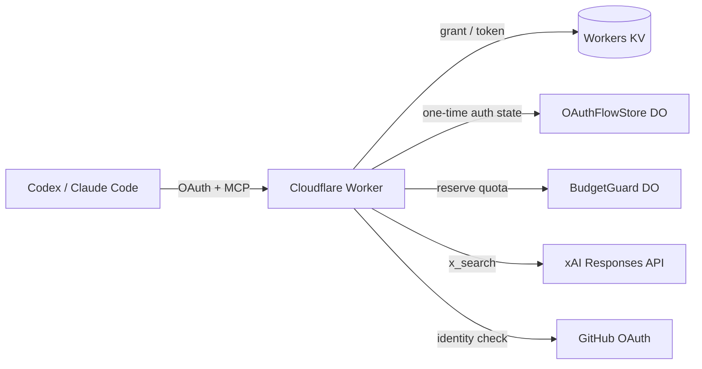

# xAI X Search Remote MCP

## Overview

- 個人用のX検索専用Remote MCP
- Cloudflare WorkersにデプロイしてGitHub OAuth Appで認証
  - Workers KV: OAuthのclient、grant、tokenの保存
  - Durable Object: 一時的なcallback stateの保存
- X検索は[xAI Responses APIのX Search tool](https://docs.x.ai/developers/tools/x-search)を使う
- クライアント側はAPMでRemote MCPを設定する: [`apm.yml`](../../apm/apm.yml)

## Setup

Cloudflare、GitHub、xAIのリソースを失った場合でも再構築できる手順。

### 1. xAI API keyを発行する

[xAI Console](https://console.x.ai/)でAPI keyを発行する。課金事故を防ぐため、auto top-upを無効にし、invoiced billing limitを`$0`にする。[xAI Billing](https://docs.x.ai/console/billing)

### 2. Cloudflareへログインする

```bash
cd tools/xai-search-mcp
npm ci --ignore-scripts
npx wrangler login
npx wrangler whoami --json
```

`whoami`の出力でデプロイ先のCloudflare accountを確認する。Cloudflare DashboardのWorkers & Pagesで`workers.dev` subdomainを確認し、次の公開URLを決める。

```text
https://xai-search-mcp.<workers.dev subdomain>.workers.dev
```

### 3. GitHub OAuth Appを作成する

[GitHub Developer settings](https://github.com/settings/applications/new)で、このMCP専用のOAuth Appを作成する。

| 設定 | 値 |
| :--- | :--- |
| Application name | `Personal xAI X Search MCP` |
| Homepage URL | `<公開URL>` |
| Authorization callback URL | `<公開URL>/callback` |

作成後にClient Secretを生成する。Client IDと数値user IDは後で`wrangler.jsonc`へ設定する。

```bash
gh api user --jq .id
```

### 4. Workers KV namespaceを作成する

```bash
npx wrangler kv namespace create OAUTH_KV
```

出力されたnamespace IDを控える。Durable Objectは`wrangler.jsonc`のmigrationにより初回デプロイ時に作成されるため、事前操作は不要。

### 5. `wrangler.jsonc`を設定する

取得した値を`wrangler.jsonc`へ設定する。

```jsonc
{
  "vars": {
    "PUBLIC_ORIGIN": "<公開URL>",
    "GITHUB_CLIENT_ID": "<GitHub OAuth AppのClient ID>",
    "ALLOWED_GITHUB_USER_ID": "<GitHubの数値user ID>"
  },
  "kv_namespaces": [
    {
      "binding": "OAUTH_KV",
      "id": "<KV namespace ID>"
    }
  ]
}
```

`PUBLIC_ORIGIN`、Client ID、数値user ID、KV namespace IDは公開設定。API keyとClient Secretはここへ書かない。

### 6. Secretを登録する

```bash
npx wrangler secret put XAI_API_KEY
npx wrangler secret put GITHUB_CLIENT_SECRET
```

入力値はCloudflare Worker Secretへ保存され、リポジトリには残らない。

### 7. デプロイして確認する

```bash
npm run check
npm run deploy
curl --fail --silent --show-error "<公開URL>/health"
```

GitHub OAuth AppのHomepage URLとcallback URLが、デプロイ後のURLと完全に一致することを確認する。

## Usage

ローカル開発では`.dev.vars.example`を`.dev.vars`へコピーし、2つのSecretを設定する。`.dev.vars`はgitignoreされる。

```bash
cd tools/xai-search-mcp
npm ci --ignore-scripts
cp .dev.vars.example .dev.vars
npm run dev
```

変更後はテスト、依存監査、デプロイを実行する。

```bash
npm run check
npm audit
npm run deploy
```

ヘルスチェック:

```bash
curl --fail --silent --show-error \
  https://xai-search-mcp.snhryt.workers.dev/health
```

## Architecture



### Authentication

MCPエンドポイント自体は公開されているため、GitHub OAuthで本人確認し、取得した数値user IDが`ALLOWED_GITHUB_USER_ID`と一致した場合だけMCPトークンを発行する。GitHubへ追加scopeは要求せず、本人確認後のaccess tokenは保存せず失効させる。

OAuth Providerが管理するclient、grant、tokenはWorkers KVへ保存する。一度だけ消費すべき同意flowとGitHub callback stateは、結果整合のKVではなく`OAuthFlowStore` Durable Objectへ保存する。

### Cost control

xAIを呼ぶ前に`BudgetGuard` Durable Objectで利用枠を予約する。上限は1ユーザーあたり5回/分、30回/UTC日。並行リクエストでも上限を越えないことを優先するため、xAI側のエラー時も予約済みの枠は戻さない。

xAIリクエストは`grok-4.3`、reasoning `none`、X検索1回、出力1,200トークンに固定する。クライアントからモデル、ツール、回数、出力量は変更できない。

### Data handling

`XAI_API_KEY`と`GITHUB_CLIENT_SECRET`はWorker Secretだけに保存する。検索語、Authorization、API key、xAIのエラー本文はログへ出さず、Workers Observabilityも無効にする。

xAIには検索語が送信され、既定ではAPIの入出力が監査目的で30日保持される。ZDRを確認できない間は、機密情報を検索語へ含めない。[xAI API Security FAQ](https://docs.x.ai/developers/faq/security)

## ADR

### Cloudflare WorkersでRemote MCPを運用する

- その他の検討パターン
  - ローカルのstdio MCP: 外部公開せず低コストで動かせるが、クライアントごとの設定と起動が必要で、別の端末から同じMCPを使えない
  - 第三者のRemote MCP: 構築と保守が不要だが、xAI API keyと検索内容を運営者へ預け、実装と運用を信頼する必要がある
  - VPSやCloud Run: 実行環境の自由度は高いが、OAuth、状態ストア、課金制御を別途構築し、VPSでは常時稼働コストも発生する
- 意思決定した理由
  - 複数クライアントと端末から同じURLを使えること、Secretを自分の管理下へ置くこと、少ない運用負荷を重視した
  - Cloudflare固有のKVとDurable Objectsに依存する欠点はあるが、第三者へSecretを預けず、常時起動サーバーなしでOAuthと状態管理を同じ基盤へまとめられる利点が上回ると判断した

### GitHub OAuthで利用者を限定する

- その他の検討パターン
  - 固定Bearer token: 実装は単純だが、全クライアントへの安全な配布、保存、ローテーションが必要で、漏えい時は本人確認なしで利用される
  - Google OIDC: 安定した`sub`で利用者を識別できるが、この用途だけのためにGoogle Cloud側のOAuth同意画面とクライアントを追加管理する必要がある
  - Cloudflare Access Managed OAuth: Workerの手前で認証とポリシーを統一できるが、Zero TrustとAccess Applicationの設定が増え、Worker自身が提供するOAuthフローとの役割分担も必要になる
  - Auth0などの外部IdP: 複数の認証方式や利用者へ拡張しやすいが、単一利用者のために新たなテナント、Secret、料金体系へ依存する
  - GitHubのlogin名によるallowlist: 数値IDより読みやすいが、変更可能であり、将来別の利用者に再取得される可能性がある
- 意思決定した理由
  - クライアント固有の認証情報を配布せず、CodexとClaude Codeの標準OAuthフローで、普段の開発に使っているGitHubアカウントをそのまま本人確認に使えることを重視した
  - GitHub OAuthは追加scopeなしでも公開プロフィールを取得でき、login名変更の影響を受けない数値user IDをallowlistに使える
  - GitHubへの依存とOAuth Appの保守は必要になるが、Googleや外部IdPを新たに管理するより構成が少なく、単一利用者にはAccessのポリシー管理より直接的である利点が上回ると判断した

### 一時状態と課金枠にDurable Objectsを使う

- その他の検討パターン
  - すべてWorkers KVへ保存: 構成が最も単純だが、結果整合性のため、OAuth stateの二重消費と並行検索時の課金枠超過を防げない
  - すべて単一のDurable Objectへ保存: 強整合なtransactionを使えるが、OAuth ProviderのKV前提から外れ、無関係な利用者状態と課金状態が一つの責務に集中する
  - D1や外部データベースへ保存: SQLや汎用的な運用手段を使えるが、この規模ではschema、接続、認証、保守の負担が機能に対して大きい
- 意思決定した理由
  - データごとに必要な整合性を満たしつつ、Cloudflare OAuth Providerの標準構成を崩さないことを重視した
  - KVと2つのDurable Objectを管理する複雑さは増えるが、永続OAuthデータにはProvider標準のKVを使い、一度きりのstateと課金枠だけを責務別の強整合ストアへ分ける利点が上回ると判断した

### xAIの機能と費用をサーバー側で固定する

- その他の検討パターン
  - モデルや上限をMCP入力で変更可能にする: 調査内容に応じて品質を調整できるが、クライアントから費用と処理範囲を拡大できてしまう
  - Web検索や画像・動画理解も提供する: 一つのMCPで幅広く調査できるが、用途と権限が曖昧になり、ツール呼び出し回数と費用が増える
  - X APIを直接利用する: エンゲージメント等の構造化データを決定的に扱えるが、別のAPI契約と課金、検索、引用、要約の実装が必要になる
- 意思決定した理由
  - 購入済みの少額クレジット内で費用を予測できることと、ユーザーが明示した場合だけXを検索する狭い権限を重視した
  - メディア解析、厳密なメトリクス取得、依頼ごとの品質調整ができない欠点はあるが、モデル、ツール回数、出力量を固定し、xAIの検索と引用生成を再利用して実装と課金を抑える利点が上回ると判断した

## Note

- 回数上限とxAIの固定値は`src/config.ts`で変更する
- 通常の`npm run deploy`では登録済みのWorker Secretは維持される
- `npx wrangler secret put <NAME>`はSecret更新と同時に新しいWorker versionをデプロイする

### OAuth認証

- `PUBLIC_ORIGIN`にはデプロイ先のHTTPS originをpathなしで設定し、GitHub OAuth AppのAuthorization callback URLは`<PUBLIC_ORIGIN>/callback`と完全一致させる
- 同意画面のCSPでは`form-action 'self' https://github.com`を維持する。`https://github.com`を許可しないと、承認ボタンのPOST後にGitHubへ遷移できず、画面上は何も起きていないように見える
- OAuth開始時のstateはHttpOnly cookieにも保存されるため、認証開始から同意完了までは同じブラウザプロファイルで進める。別のブラウザへ移すと`Consent state failure: missing`になる
- OAuth同意stateは10分で失効する。`Consent request expired`になった場合は、残っている同意画面を再利用せず、クライアントからOAuth認証をやり直す
