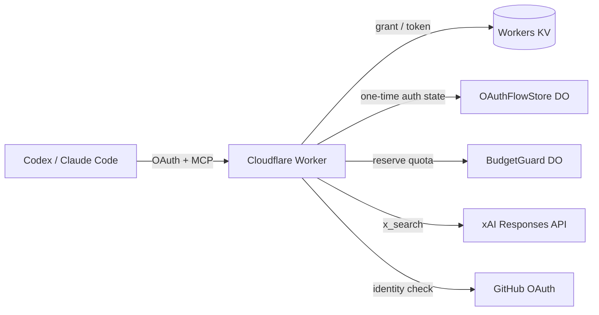

# xAI X Search Remote MCP

## Overview

- 個人用のX検索専用Remote MCP
- Cloudflare WorkersにデプロイしてGitHub OAuth Appで認証
  - Workers KV: OAuthのclient、grant、tokenの保存
  - Durable Object: 一時的なcallback stateの保存
- X検索は[xAI Responses APIのX Search tool](https://docs.x.ai/developers/tools/x-search)を使う
- クライアント側はAPMでRemote MCPを設定する: [`apm.yml`](../../apm/apm.yml)

## Setup

Cloudflare、GitHub、xAIのリソースを失った場合でも再構築できる手順。

### 1. xAI API keyを発行する

[xAI Console](https://console.x.ai/)でAPI keyを発行する。課金事故を防ぐため、auto top-upを無効にし、invoiced billing limitを`$0`にする。[xAI Billing](https://docs.x.ai/console/billing)

### 2. Cloudflareへログインする

```bash
cd tools/xai-search-mcp
npm ci --ignore-scripts
npx wrangler login
npx wrangler whoami --json
```

`whoami`の出力でデプロイ先のCloudflare accountを確認する。Cloudflare DashboardのWorkers & Pagesで`workers.dev` subdomainを確認し、次の公開URLを決める。

```text
https://xai-search-mcp.<workers.dev subdomain>.workers.dev
```

### 3. GitHub OAuth Appを作成する

[GitHub Developer settings](https://github.com/settings/applications/new)で、このMCP専用のOAuth Appを作成する。

| 設定 | 値 |
| :--- | :--- |
| Application name | `Personal xAI X Search MCP` |
| Homepage URL | `<公開URL>` |
| Authorization callback URL | `<公開URL>/callback` |

作成後にClient Secretを生成する。Client IDと数値user IDは後で`wrangler.jsonc`へ設定する。

```bash
gh api user --jq .id
```

### 4. Workers KV namespaceを作成する

```bash
npx wrangler kv namespace create OAUTH_KV
```

出力されたnamespace IDを控える。Durable Objectは`wrangler.jsonc`のmigrationにより初回デプロイ時に作成されるため、事前操作は不要。

### 5. `wrangler.jsonc`を設定する

取得した値を`wrangler.jsonc`へ設定する。

```jsonc
{
  "vars": {
    "PUBLIC_ORIGIN": "<公開URL>",
    "GITHUB_CLIENT_ID": "<GitHub OAuth AppのClient ID>",
    "ALLOWED_GITHUB_USER_ID": "<GitHubの数値user ID>"
  },
  "kv_namespaces": [
    {
      "binding": "OAUTH_KV",
      "id": "<KV namespace ID>"
    }
  ]
}
```

`PUBLIC_ORIGIN`、Client ID、数値user ID、KV namespace IDは公開設定。API keyとClient Secretはここへ書かない。

### 6. Secretを登録する

```bash
npx wrangler secret put XAI_API_KEY
npx wrangler secret put GITHUB_CLIENT_SECRET
```

入力値はCloudflare Worker Secretへ保存され、リポジトリには残らない。

### 7. デプロイして確認する

```bash
npm run check
npm run deploy
curl --fail --silent --show-error "<公開URL>/health"
```

GitHub OAuth AppのHomepage URLとcallback URLが、デプロイ後のURLと完全に一致することを確認する。

## Usage

ローカル開発では`.dev.vars.example`を`.dev.vars`へコピーし、2つのSecretを設定する。`.dev.vars`はgitignoreされる。

```bash
cd tools/xai-search-mcp
npm ci --ignore-scripts
cp .dev.vars.example .dev.vars
npm run dev
```

変更後はテスト、依存監査、デプロイを実行する。

```bash
npm run check
npm audit
npm run deploy
```

ヘルスチェック:

```bash
curl --fail --silent --show-error \
  https://xai-search-mcp.snhryt.workers.dev/health
```

## Architecture



### Authentication

MCPエンドポイント自体は公開されているため、GitHub OAuthで本人確認し、取得した数値user IDが`ALLOWED_GITHUB_USER_ID`と一致した場合だけMCPトークンを発行する。GitHubへ追加scopeは要求せず、本人確認後のaccess tokenは保存せず失効させる。

OAuth Providerが管理するclient、grant、tokenはWorkers KVへ保存する。一度だけ消費すべき同意flowとGitHub callback stateは、結果整合のKVではなく`OAuthFlowStore` Durable Objectへ保存する。

### Cost control

xAIを呼ぶ前に`BudgetGuard` Durable Objectで利用枠を予約する。上限は1ユーザーあたり5回/分、30回/UTC日。並行リクエストでも上限を越えないことを優先するため、xAI側のエラー時も予約済みの枠は戻さない。

xAIリクエストは`grok-4.3`、reasoning `none`、X検索1回、出力1,200トークンに固定する。クライアントからモデル、ツール、回数、出力量は変更できない。

### Data handling

`XAI_API_KEY`と`GITHUB_CLIENT_SECRET`はWorker Secretだけに保存する。検索語、Authorization、API key、xAIのエラー本文はログへ出さず、Workers Observabilityも無効にする。

xAIには検索語が送信され、既定ではAPIの入出力が監査目的で30日保持される。ZDRを確認できない間は、機密情報を検索語へ含めない。[xAI API Security FAQ](https://docs.x.ai/developers/faq/security)

## ADR

### Cloudflare WorkersでRemote MCPを運用する

- **背景**: CodexとClaude Codeから同じMCPを使いつつ、第三者のMCPサーバーへxAI API keyを渡したくなかった
- **決定**: 自分のCloudflareアカウントでRemote MCPを運用し、APMから同じURLを両クライアントへ配布する
- **影響**: ローカルプロセスなしで利用できる一方、Workerと状態ストアの保守は自分で行う

### GitHub OAuthで利用者を限定する

- **背景**: 公開URLを知る第三者にxAIの利用料金を発生させられる可能性がある
- **決定**: 専用GitHub OAuth Appで本人確認し、変更可能なlogin名ではなく数値user IDをallowlistと照合する
- **影響**: GitHubアカウントへ依存するが、単一利用者を安定して識別できる

### 一時状態と課金枠にDurable Objectsを使う

- **背景**: Workers KVの結果整合性では、OAuth stateの一度きり消費と並行検索の厳密な回数制限を保証できない
- **決定**: OAuth Providerの永続データはKV、一時状態と課金枠は責務別のDurable Objectへ保存する
- **影響**: 構成要素は増えるが、認可flowの二重消費と課金上限超過をtransactionで防げる

### xAIの機能と費用をサーバー側で固定する

- **背景**: クライアント入力でモデルやツール回数を変更できると、用途外の処理と予期しない課金が発生する
- **決定**: X検索以外のツール、複数回のツール呼び出し、画像・動画理解を許可しない
- **影響**: 費用を予測しやすい代わりに、複雑な調査とメディア解析には対応しない

## Note

- 回数上限とxAIの固定値は`src/config.ts`で変更する
- 通常の`npm run deploy`では登録済みのWorker Secretは維持される
- `npx wrangler secret put <NAME>`はSecret更新と同時に新しいWorker versionをデプロイする
- OAuth同意stateは10分で失効する。期限切れ時はクライアントからOAuth認証をやり直す

参考資料: [xAI X Search](https://docs.x.ai/developers/tools/x-search)、[xAI Pricing](https://docs.x.ai/developers/pricing)、[Cloudflare Workers OAuth Provider](https://github.com/cloudflare/workers-oauth-provider)、[Cloudflare MCP security guide](https://developers.cloudflare.com/agents/model-context-protocol/guides/securing-mcp-server/)
