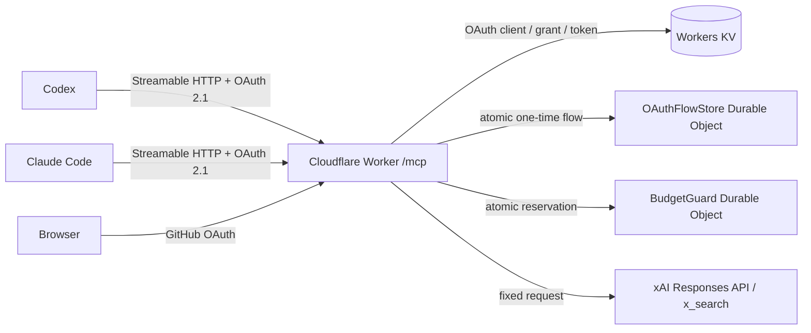

# xAI X Search Remote MCP

TL;DR

- Cloudflare Workers上で動く、個人用のX検索専用Remote MCP。
- MCPはステートレスなStreamable HTTP。OAuth Providerのgrant/tokenはKV、一時的な認可flowと厳密な回数制限は責務別のDurable Objectへ分離する。
- GitHub OAuthで取得した変更されない数値user IDがallowlistと一致した場合だけMCPトークンを発行する。
- `XAI_API_KEY`と`GITHUB_CLIENT_SECRET`はWorker Secretにのみ保存する。
- xAI側は`grok-4.3`、reasoning `none`、X検索1回、出力1,200トークンに固定する。
- CodexとClaude Codeは同じ`/mcp` URLからOAuth discoveryとCIMD/DCRを実行できる。

## 構成



Cloudflareの現行`createMcpHandler()`とMCP SDK v2を使う。セッションID、SSE互換サーバー、`McpAgent`は使わない。[Cloudflare MCP handler API](https://developers.cloudflare.com/agents/model-context-protocol/apis/handler-api/)

## セキュリティ境界

| 観点 | 実装 |
| :--- | :--- |
| 利用者 | GitHubの数値user IDを完全一致で検証。login名の変更に影響されない |
| MCP認可 | OAuth 2.1、S256 PKCE、RFC 9728/RFC 8414 discovery、CIMDとDCR。DCR、認可GET、同意POST、GitHub callbackを用途別に接続元IPごと5回/分 |
| 同意画面 | 上流GitHubへ遷移する前に表示。強整合な専用Durable Objectへhash保存した使い捨てCSRF token、同一origin検証、補助cookie、10分TTL、CSPを適用 |
| OAuth一時state | consent approvalは`OAuthFlowStore`内でGitHub stateへ原子的に遷移し、同一proofの重複POSTへ同じredirectとcookieを返す。GitHub callback stateは一度だけ消費。GitHub stateとは独立したHttpOnly cookie秘密をproofにし、alarmで期限切れデータを削除 |
| GitHub権限 | S256 PKCEを使用し、追加scopeなしで`/user`だけを取得。数値ID確認後、GitHub tokenを保存せず失効 |
| xAI権限 | 接続先、モデル、reasoning、ツール、ツール回数、出力量をサーバー側で固定 |
| 課金防止 | 1ユーザーあたり5回/分、30回/UTC日。Durable Object transactionで先に枠を予約。ツールは課金状態を変えるためread-only扱いにしない |
| 入力 | query 2,000文字、handle 20件、期間366日、未知フィールド・矛盾条件を拒否 |
| 出力 | 20,000文字と引用50件で切り詰め。画像・動画理解は常に無効 |
| ログ | 検索全文、Authorization、API key、上流エラー本文を出力しない。Workers Observabilityも既定で無効 |

> [!IMPORTANT]
> 回数枠はxAI呼び出し前に消費し、上流エラー時も戻さない。障害時の利便性より、並行呼び出しや再試行による予算超過防止を優先する。ただし、回数上限は厳密なUSD上限ではない。xAI側のTeam spending limitまたはプリペイド残高も必ず併用する。

xAIのX Searchは成功したツール呼び出し単位で課金され、1リクエスト内で複数回呼ばれ得る。このWorkerは`max_tool_calls: 1`を設定し、応答の実請求額も`cost_in_usd_ticks`から表示する。[xAI X Search](https://docs.x.ai/developers/tools/x-search)、[xAI Cost Tracking](https://docs.x.ai/developers/cost-tracking)、[xAI Pricing](https://docs.x.ai/developers/pricing)

xAIへ検索語と検索結果が送信され、既定ではAPIの入出力を監査目的で30日保持する。ZDRを確認できない状態では機密情報を検索語へ入れない。必要ならxAI teamでZDRを有効化し、APIレスポンスの`x-zero-data-retention: true`を確認する。[xAI API Security FAQ](https://docs.x.ai/developers/faq/security)

## 初回セットアップ

### 1. 依存関係とCloudflare認証

```bash
cd tools/xai-search-mcp
npm ci --ignore-scripts
npx wrangler login
```

### 2. Worker URLとGitHub OAuth App

Workers subdomainを確認し、公開originを決める。

```text
https://xai-search-mcp.<workers-subdomain>.workers.dev
```

[GitHub OAuth App](https://github.com/settings/developers)を、このMCP専用として新規作成する。他サービスとOAuth Appを共有すると、以前に付与した広いscopeがGitHub tokenへ引き継がれ得るため共有しない。Workerもscopeが空でないtokenを拒否する。

| GitHub設定 | 値 |
| :--- | :--- |
| Homepage URL | 上記の公開origin |
| Authorization callback URL | `<公開origin>/callback` |

Client IDを控え、Client secretを1つ生成する。GitHub user IDは以下で確認できる。

```bash
gh api user --jq .id
```

xAI Consoleではauto top-upを無効、invoiced billing limitを`$0`にする。これにより、購入済みのプリペイド残高を超える課金をxAI側でも止める。[xAI Billing](https://docs.x.ai/console/billing)

### 3. OAuth Provider用KV namespace

```bash
npx wrangler kv namespace create OAUTH_KV
```

出力されたnamespace IDを控える。

このKVはOAuth Providerライブラリのclient、grant、token保存用。一時的なconsent flowとGitHub stateには、強整合な`OAuthFlowStore` Durable Objectを使う。[Workers KV consistency](https://developers.cloudflare.com/kv/concepts/how-kv-works/)、[Durable Objects storage](https://developers.cloudflare.com/durable-objects/best-practices/access-durable-objects-storage/)

### 4. 公開設定

[`wrangler.jsonc`](./wrangler.jsonc)のプレースホルダーを置き換える。

| 項目 | 設定値 |
| :--- | :--- |
| `PUBLIC_ORIGIN` | WorkerのHTTPS origin。末尾`/`なし |
| `GITHUB_CLIENT_ID` | GitHub OAuth AppのClient ID |
| `ALLOWED_GITHUB_USER_ID` | `gh api user --jq .id`の数値 |
| `kv_namespaces[0].id` | 作成したKV namespace ID |

これらは秘密ではない。xAI API keyとGitHub Client secretはファイルへ書かない。

### 5. Secretとデプロイ

```bash
npx wrangler secret put XAI_API_KEY
npx wrangler secret put GITHUB_CLIENT_SECRET
npm run check
npm run deploy
```

> [!WARNING]
> `.dev.vars`はローカル開発専用でGit管理外。実値を`.dev.vars.example`、`wrangler.jsonc`、APM設定へ書かない。

## 接続

### APM

[`../../apm/apm.yml`](../../apm/apm.yml)に本番URLを登録済み。mainへマージ後に適用する。

```bash
(cd ../.. && task skills)
```

APMにはURLだけを宣言する。Client IDやtokenは置かず、各クライアントが標準discoveryからCIMDまたはDCRを選択する。[APM MCP server guide](https://microsoft.github.io/apm/guides/mcp-servers/)

### Codex

APMを使わない場合の最小設定:

```toml
[mcp_servers.xai-search]
url = "https://xai-search-mcp.snhryt.workers.dev/mcp"
enabled_tools = ["x_search"]
default_tools_approval_mode = "prompt"
tool_timeout_sec = 90
```

認証を開始する。

```bash
codex mcp login xai-search
```

CodexはStreamable HTTP、OAuth、CIMD、DCRに対応する。[OpenAI公式MCPドキュメント](https://developers.openai.com/codex/mcp)

### Claude Code

APMを使わない場合はuser scopeへ追加する。

```bash
claude mcp add --transport http --scope user xai-search \
  https://xai-search-mcp.snhryt.workers.dev/mcp
```

Claude Code内で`/mcp`を開き、ブラウザ認証を完了する。Claude CodeはHTTP MCPのOAuth discovery、CIMD、DCRに対応する。[Claude Code MCP documentation](https://code.claude.com/docs/en/mcp)

## 動作確認

```bash
MCP_ORIGIN=https://xai-search-mcp.snhryt.workers.dev
curl --fail --silent --show-error "$MCP_ORIGIN/health"
curl --silent --show-error "$MCP_ORIGIN/.well-known/oauth-protected-resource/mcp" | jq
curl --silent --show-error "$MCP_ORIGIN/.well-known/oauth-authorization-server" | jq
curl --include --silent --show-error --request POST "$MCP_ORIGIN/mcp" \
  --header 'Content-Type: application/json' \
  --data '{"jsonrpc":"2.0","id":1,"method":"initialize","params":{"protocolVersion":"2025-11-25","capabilities":{},"clientInfo":{"name":"smoke-test","version":"1"}}}'
```

最後の未認証リクエストが`401`と`WWW-Authenticate`を返し、保護リソースmetadata URLを示すことを確認する。必要なら[MCP Inspector](https://modelcontextprotocol.io/docs/tools/inspector)でもOAuthを含む接続を確認する。

### 同意POSTの診断

同意画面の送信に失敗した場合、レスポンス本文は秘密値を含まない`Consent state failure: <code>`を返す。GitHub callbackはこの区別を外部へ返さない。

| code | HTTP | 意味 |
| :--- | :--- | :--- |
| `missing` | 400 | flowが存在しない、消費済み、または期限切れ |
| `forbidden` | 400 | formから得たproofが保存済みhashと不一致 |
| `invalid` | 400 | flow ID・proof形式、またはDOへのconsume入力が不正 |
| `internal` | 503 | DO呼び出し失敗、想定外status、または不正な内部response |

## 運用

- 回数上限は[`src/config.ts`](./src/config.ts)の`PER_MINUTE_LIMIT`と`PER_DAY_LIMIT`を変更して再デプロイする。
- xAI model、reasoning、ツール回数、出力量も同ファイルで固定する。クライアント入力からは変更できない。
- Secretローテーションは`npx wrangler secret put <NAME>`で実施する。
- 依存更新時は`npm install <package>@<version> --save-exact`を使い、`npm run check`と`npm audit`を通す。
- OAuth ProviderのKVデータは期限切れ後も一覧に残る場合がある。定期削除を追加する場合は公式`purgeExpiredData()`をCron Triggerから呼ぶ。
- `OAuthFlowStore`は固定singleton内でflowをキー分離し、proof照合と削除を同じtransactionで実行する。誤ったproofでは削除せず、正しいproofによるconsumeだけを一度成功させる。期限切れはalarmで削除し、`OAUTH_KV`へ一時stateを戻さない。
- approvalの重複送信は、最初のtransactionが確定したGitHub state・PKCE challenge・browser nonceを期限内だけ再利用する。GitHub callback自体は冪等化せず、一度きりのままにする。
- DCR登録は7日で失効し、client metadataを8 KiB、redirect URIを10件・各2,048文字に制限する。DCR登録、認可GET、同意POST、GitHub callbackは、Workers Rate Limiting bindingで用途別に接続元IPごと5回/分に抑える。分散送信への追加防御が必要なら、custom domainのWAF rate limitingを`/oauth/register`、`/authorize`、`/callback`へ追加する。[Workers Rate Limiting](https://developers.cloudflare.com/workers/runtime-apis/bindings/rate-limit/)、[WAF rate limiting](https://developers.cloudflare.com/waf/rate-limiting-rules/)
- Observabilityを有効にする場合も、検索語やリクエスト/レスポンス本文をログへ追加しない。

Cloudflare OAuth ProviderはMCPのBearer challenge、保護リソースmetadata、認可サーバーmetadata、CIMD/DCRを提供する。[Cloudflare Workers OAuth Provider](https://github.com/cloudflare/workers-oauth-provider)、[Cloudflare MCP security guide](https://developers.cloudflare.com/agents/model-context-protocol/guides/securing-mcp-server/)
